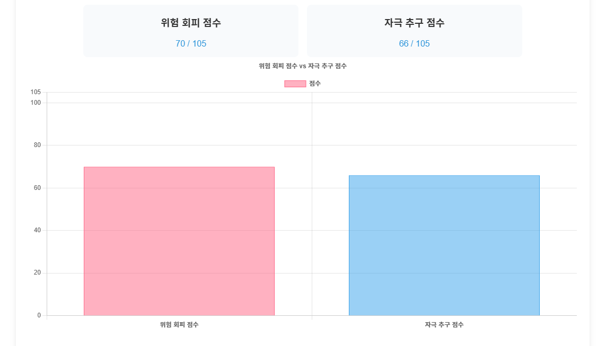

# Mindafy

## 프로젝트 소개
심리검사 기반 금융상품 추천 서비스
### 진행 기간
2024.11.18 ~ 2024.11.27
### 기획 배경
- 은행에서 기존 시행하고 있는 금융 투자 설문은 투자 경험 및 규모, 기간, 투자위험도 등 구체적인 정보 위주였습니다. 그 중에서도 투자위험도를 묻는 질문이 대부분의 은행에서 단 1개뿐이었습니다. 그래서 이 부분을 더 보완하면 좋겠다는 생각이 들어 프로젝트를 진행했습니다. 

### 프로젝트 설명
- 이 프로젝트는 금융을 주제로 한 SSAFY 1학기 최종 관통 프로젝트입니다.
- Mindafy는 'Mind'와 'ify'를 결합해 '마음을 변화시키다'라는 의미를 가진 심리테스트 서비스입니다. 
- 여러 심리테스트 결과를 SNS에 공유하길 좋아하는 10대 ~ 30대 초반이 주로 이용합니다.
- 금융상품에 투자하기 망설이던 사람들이 평소에 자주 즐기던 심리테스트 서비스에서 금융상품 추천 테스트를 한다면, 보다 가벼운 마음으로 흥미를 가지고 접근할 수 있을 것입니다.
- 그래서 Mindafy를 자주 이용하는 사람들 중 이제 막 취업해 돈에 여유가 생긴, 투자를 하고 싶었으나 망설이던 2 ~ 30대 사회초년생을 구체적인 타겟으로 설정했습니다.
- 이 프로젝트에서는 심리테스트 서비스, 심리검사 기반 금융상품 추천 테스트를 구현했습니다. 금융상품 추천 테스트는 심리검사 결과와 금융설문에 따라 달라지는 알고리즘을 지니고 있습니다.
- 심리검사는 TCI검사의 자극추구성향, 위험회피성향을 측정하기 위한 문항을 현재 우리나라에 맞게 번안하여 각 15개씩으로 구성됩니다.

### 팀원 정보
이름|역할|구현기능
|--|--|--|
박태현|팀장| Front-End - 와이어프레임, 컴포넌트 구조, 금융상품 추천 알고리즘, 시작페이지 · 유저페이지 · 메인페이지 · 테스트페이지 · 설문페이지 · 결과페이지 · 댓글 디자인 및 기능 구현
주현호|팀원| Back-End - ERD, API 컨벤션, 금융상품 추천 알고리즘, REST API 설계, 금융데이터 전처리, 유저 · 테스트 · 댓글 CRUD, 더미데이터 생성, 심리검사 제작, AI 이미지 제작

### 기술 스택
- Git
- Front
    - language
        - HTML
        - CSS
        - JavaScript 
    - framework
        - Vue3
        - Pinia
        - axios
        - chart.js
    - Figma

- Back
    - language
        - Python
    - framework
        - Django
        - Django-rest-framework
        - dj-rest-auth
    - DB
        - SQLite

## 산출물

### 프로젝트 구조
```python
Mindafy
├─Mindafy-back
│  ├─accounts
│  ├─comments
│  │  ├─fixtures
│  ├─finance
│  ├─likes
│  ├─mindafy
│  ├─static
│  │  ├─test_img
│  │  └─test_results
│  │      └─test1
│  ├─staticfiles
│  ├─surveys
│  │  ├─fixtures
│  ├─tests
│  │  ├─fixtures
└─Mindafy-front
    └─front
        └─src
            ├─components
	│  ├─CommentList
	│  ├─CommentListItem
	│  ├─Logout
	│  ├─SurveyList
	│  ├─SurveyListItem
	│  ├─SurveyListItemOp
	│  ├─TestList
	│  ├─TestListItem
            ├─router
            ├─stores
            └─views
	│  ├─CreateView
	│  ├─DetailView
	│  ├─LogInView
	│  ├─ResultETFView
	│  ├─ResultJukView
	│  ├─ResultView
	│  ├─SignUpView
	│  ├─StartView
	│  ├─SurveyView
	│  ├─TestView
	│  ├─UserView
  	├─App
```
### 와이어프레임


### 컴포넌트 구조


### ERD


### 금융상품 추천 알고리즘


### API 컨벤션
[API 컨벤션](./etc/API컨벤션.pdf)


## 실행화면
- 시작 페이지

- 메인 페이지

- 회원가입 페이지

- 로그인 페이지

- 프로필 수정 페이지

- 테스트 페이지

- 설문 페이지

- 결과 페이지


